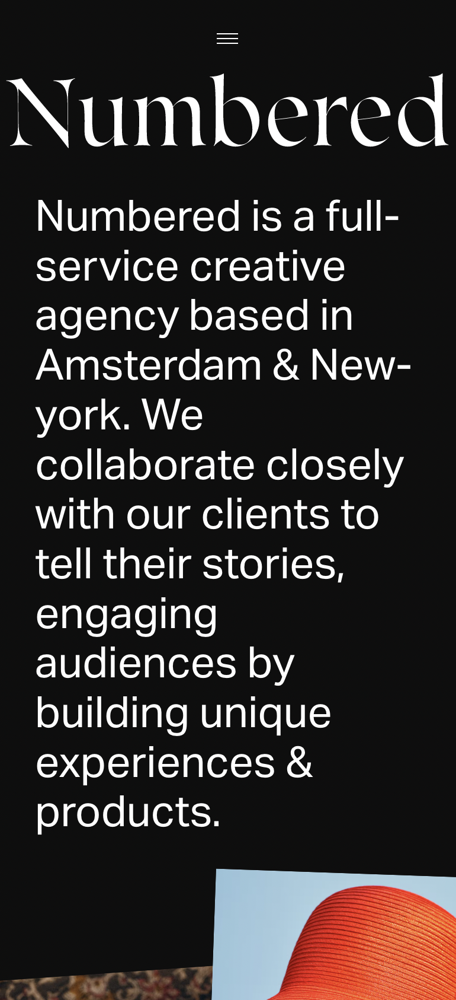
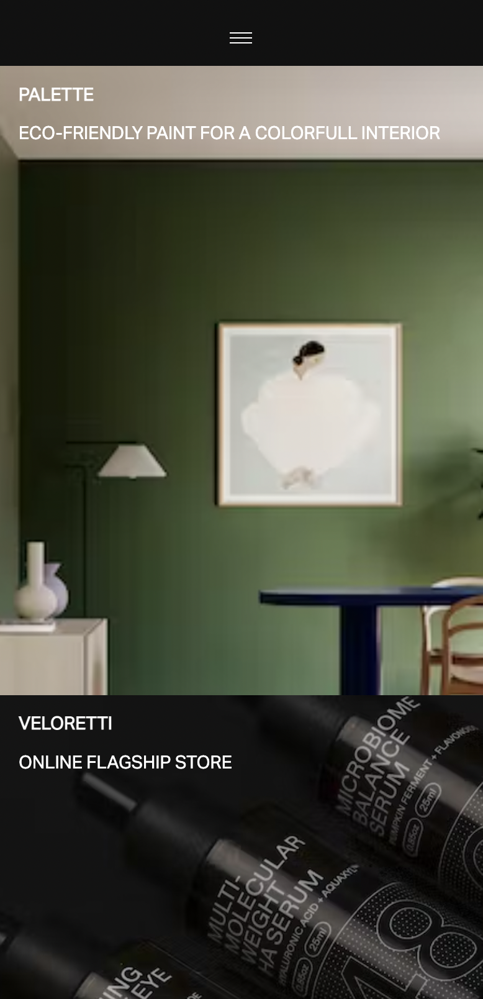

# Procesverslag
Markdown is een simpele manier om HTML te schrijven.  
Markdown cheat cheet: [Hulp bij het schrijven van Markdown](https://github.com/adam-p/markdown-here/wiki/Markdown-Cheatsheet).

Nb. De standaardstructuur en de spartaanse opmaak van de README.md zijn helemaal prima. Het gaat om de inhoud van je procesverslag. Besteedt de tijd voor pracht en praal aan je website.

Nb. Door *open* toe te voegen aan een *details* element kun je deze standaard open zetten. Fijn om dat steeds voor de relevante stuk(ken) te doen.

## Jij

  
uitwerken voor kick-off werkgroep

  ### Auteur:
  Gylianto Monadjat

  #### Je startniveau:
  Blauwe piste

  #### Je focus:
  Responsive design
 

## Je website

  
uitwerken voor kick-off werkgroep

  ### Je opdracht:
  link naar de website die je gaat namaken óf de naam/omschrijving van je eigen ontwerp
  https://numbered.com/

  #### Screenshot(s) van de eerste pagina (small screen): 
  Home
  

  #### Screenshot(s) van de tweede pagina (small screen):
  Work
  
 

## Toegankelijkheidstest 1/2 (week 1)

  
uitwerken na test in 1e werkgroep

  ### Bevindingen
  Lijst met je bevindingen die in de test naar voren kwamen:

  #### Screenreader
  Hier korte omschrijving (met indien nodig afbeeldingen)

  Hier een omschrijving van hoe het opgelost kan worden (met indien nodig afbeeldingen)

  #### Muis en Toetsenbord 
  Hier korte omschrijving (met indien nodig afbeeldingen)

  Hier een omschrijving van hoe het opgelost kan worden (met indien nodig afbeeldingen)

  #### Motoriek (shocks, elastiekjes)
  Hier korte omschrijving (met indien nodig afbeeldingen)

  Hier een omschrijving van hoe het opgelost kan worden (met indien nodig afbeeldingen)

  #### Visueel (brillen, contrast, kleurenblind, dark/light). 
  Hier korte omschrijving (met indien nodig afbeeldingen)

  Hier een omschrijving van hoe het opgelost kan worden (met indien nodig afbeeldingen)

## Breakdownschets (week 1)

  
uitwerken na afloop 2e werkgroep

  ### de hele pagina: 
  

  ### dynamisch deel (bijv menu): 
  

  ### wellicht nog een dynamisch deel (bijv filter): 
  

## Voortgang 1 (week 2)

  
uitwerken voor 1e voortgang

  ### Stand van zaken
  hier dit ging goed & dit was lastig (neem ook screenshots op van delen van je website en code)

  Ik ben begonnen aan de html structuur van de website. Hierbij moet ik rekening houden dat sommige elementen niet zichtbaar
  zijn op de mobiele versie maar wel op desktopversie. Dit heb ik meegenomen in de structuur van de html en het gaat opzich
  wel prima.

  ### Verslag van meeting
  hier na afloop snel de uitkomsten van de meeting vastleggen

  - Uitzoeken hoe werkt
  - Minder classes

## Voortgang 2 (week 3)

  
uitwerken voor 2e voortgang

  ### Stand van zaken
  hier dit ging goed & dit was lastig (neem ook screenshots op van delen van je website en code)

  Ik heb de html structuur af gekregen en ook het grootste gedeelte van de css. Wel heb ik wat problemen
  met het responsive maken van een image grid maar dit gaat hopelijk nog wel lukken.

  ### Verslag van meeting
  hier na afloop snel de uitkomsten van de meeting vastleggen

  - Ik heb met de student assistent een optie gevonden hoe ik de 3 column image grid kan maken
  - Ik heb nog een javascript micro interaction nodig.

## Toegankelijkheidstest 2/2 (week 4)

  
uitwerken na test in 8e werkgroep

  ### Bevindingen
  Lijst met je bevindingen die in de test naar voren kwamen (geef ook aan wat er verbeterd is):

  #### Screenreader
  Hier korte omschrijving (met indien nodig afbeeldingen)
  De screenreader ziet de links in de header en footer

  Hier een omschrijving van hoe het opgelost kan worden (met indien nodig afbeeldingen)

  #### Muis en Toetsenbord 
  Hier korte omschrijving (met indien nodig afbeeldingen)
  Enkel de links van de website zijn selecteerbaar met de de tab button.

  Hier een omschrijving van hoe het opgelost kan worden (met indien nodig afbeeldingen)
  De links op de site zijn het belangrijkst dus ik denk niet dat het echt nodig is om meer
  elementen selecteerbaar te maken met de tab button.

  #### Motoriek (shocks, elastiekjes)
  Hier korte omschrijving (met indien nodig afbeeldingen)
  De site is goed te gebruiken met een beperking de content is duidelijk en makkelijk aan te klikken.
  Hier een omschrijving van hoe het opgelost kan worden (met indien nodig afbeeldingen)

  #### Visueel (brillen, contrast, kleurenblind, dark/light). 
  Hier korte omschrijving (met indien nodig afbeeldingen)
  Dit heb ik niet kunnen testen.

## Voortgang 3 (week 4)

  
uitwerken voor 3e voortgang

  ### Stand van zaken
  hier dit ging goed & dit was lastig (neem ook screenshots op van delen van je website en code)
  Ik heb de css en de html inprincipe af ik ben bezig geweest met bug fixing en het improven van de css.

  ### Verslag van meeting
  hier na afloop snel de uitkomsten van de meeting vastleggen

  - Ik ben op de goede weg maar ik moet opletten op de semantiek van de website.
  - Ik moet een css variable toepassen

## Eindgesprek (week 5)

  
uitwerken voor eindgesprek

  ### Je uitkomst - karakteristiek screenshots:
  

  ### Dit ging goed/Heb ik geleerd: 
  Korte omschrijving met plaatjes

  

  Hoe je met flexbox een 3 column grid kan maken en kan rescalen naar een andere volgorde

   

   Hoe je met flex een 4 col section in mobile kan transformen naar 1 col

  ### Dit was lastig/Is niet gelukt:
  Korte omschrijving met plaatjes

  

  Ik vond het lastig om de images op de volledig goede manier te laten overlappen en ook nog responsive te houden.

## Bronnenlijst

  
continu bijhouden terwijl je werkt

  Nb. Wees specifiek ('css-tricks' als bron is bijv. niet specifiek genoeg).

3 image grid op de index page:
https://stackoverflow.com/questions/44603729/how-to-use-flexbox-to-layout-multiple-columns

Text underline micro interaction:
https://css-irl.info/animating-underlines/

Footer numbered logo:
https://stackoverflow.com/questions/16489937/how-do-i-horizontally-center-a-span-element-inside-a-div

Center text in logo grid:
https://github.com/ianstormtaylor/slate/issues/2359

Align span center:
https://stackoverflow.com/questions/8392211/html-span-align-center-not-working

